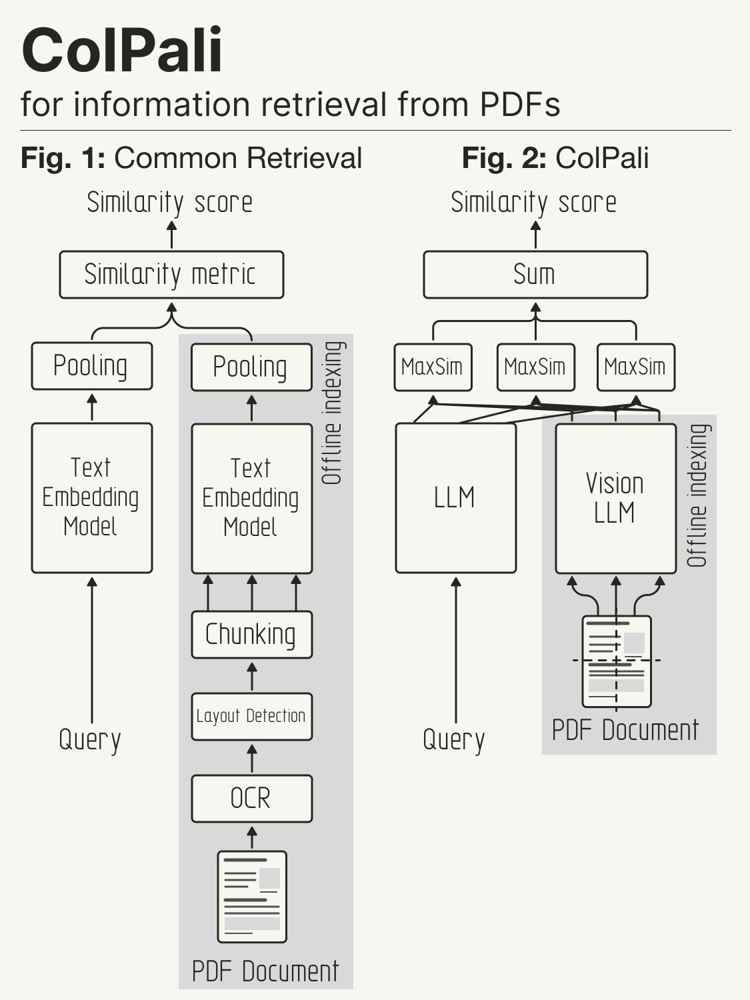
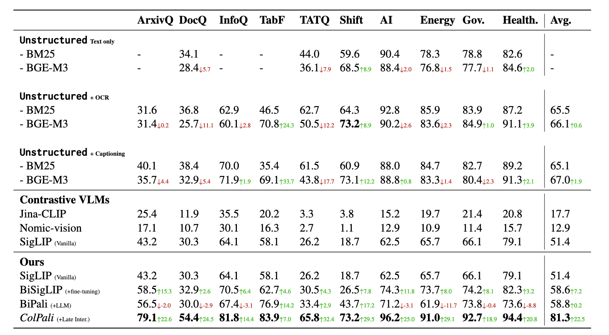

# ColiVara = COntextualized Late Interaction Vision Augmented Retrieval API

[](https://codecov.io/gh/tjmlabs/ColiVara) [](https://github.com/tjmlabs/Colivara/actions/workflows/test.yml)

**State of the Art Retrieval - with a delightful developer experience**

Colivara is a suite of services that allows you to store, search, and retrieve documents based on their **_visual_** embedding.

It is a web-first implementation of the ColiPali paper using ColQwen2 as the LLM model. It works exactly like RAG from the end-user standpoint - but using vision models instead of chunking and text-processing for documents.

### Quick Usage:

1. Get an API Key from the [ColiVara Website](https://colivara.com) or run the API locally (see below).

2. Install the Python SDK and use it to interact with the API.

```bash
pip install colivara-py
```

3. Index a document. Colivara accepts a file url, or base64 encoded file, or a file path. We support over 100 file formats including PDF, DOCX, PPTX, and more. We will also automically take a screenshot of URLs (webpages) and index them.

```python
from colivara_py import ColiVara

rag_client = ColiVara(
    # this is the default and can be omitted
    api_key=os.environ.get("COLIVARA_API_KEY"),
    base_url="https://api.colivara.com"
)

# Upload a document to the default collection
document = rag_client.upsert_document(
    name="sample_document",
    url="https://example.com/sample.pdf",
    metadata={"author": "John Doe"}
)
```

4. Search for a document. You can filter by collection name, collection metadata, and document metadata. You can also specify the number of results you want.

```python
results = rag_client.search(query="machine learning")
print(results) # top 3 pages with the most relevant information
```

### Why?

RAG (Retrieval Augmented Generation) is a powerful technique that allows us to enhance LLMs (Language Models) output with private documents and proprietary knowledge that is not available elsewhere. (For example, a company's internal documents or a researcher's notes).

However, it is limited by the quality of the text extraction pipeline. With limited ability to extract visual cues and other non-textual information, RAG can be suboptimal for documents that are visually rich.

ColiVara uses vision models to generate embeddings for documents, allowing you to retrieve documents based on their visual content.

_From the ColiPali paper:_

> Documents are visually rich structures that convey information through text, as well as tables, figures, page layouts, or fonts. While modern document retrieval systems exhibit strong performance on query-to-text matching, they struggle to exploit visual cues efficiently, hindering their performance on practical document retrieval applications such as Retrieval Augmented Generation.

[Learn More in the ColiPali Paper](https://arxiv.org/abs/2407.01449)

**How does it work?**

_Credit: [helloIamleonie on X](https://x.com/helloiamleonie)_



## Key Features

- **State of the Art retrieval**: The API is based on the ColiPali paper and uses the ColQwen2 model for embeddings. It outperforms existing retrieval systems on both quality and latency.
- **User Management**: Multi-user setup with each user having their own collections and documents.
- **Wide Format Support**: Supports over 100 file formats including PDF, DOCX, PPTX, and more.
- **Webpage Support**: Automatically takes a screenshot of webpages and indexes them even if it not a file.
- **Collections**: A user can have multiple collections. For example, a user can have a collection for research papers and another for books. Allowing for efficient retrieval and organization of documents.
- **Documents**: Each collection can have multiple documents with unlimited and user-defined metadata.
- **Filtering**: Filtering for collections and documents on arbitrary metadata fields. For example, you can filter documents by author or year. Or filter collections by type.
- **Convention over Configuration**: The API is designed to be easy to use with opinionated and optimized defaults.
- **Modern PgVector Features**: We use HalfVecs for faster search and reduced storage requirements.
- **REST API**: Easy to use REST API with Swagger documentation.
- **Comprehensive**: Full CRUD operations for documents, collections, and users.
- **Dockerized**: Easy to setup and run with Docker and Docker Compose.

## Evals:

The ColiPali team has provided the following evals in their paper. We have run quick sanity checks on the API and the Embeddings Service and are getting similar results. We are working on own independent evals and will update this section with our results.



## Components:

1. Postgres DB with pgvector extension for storing embeddings. (This repo)
2. REST API for document/collection management (This repo)
3. Embeddings Service. This needs a GPU with at least 8gb VRAM. The code is under [`ColiVarE`](https://github.com/tjmlabs/ColiVarE) repo and is optimized for a serverless GPU workload.

   > You can run the embedding service seperately and use your own storage and API for the rest of the components. The Embedding service is designed to be modular and can be used with any storage and API. (For example, if you want to use Qdrant for storage and Node for the API)

4. Language-specific SDKs for the API (Typescript SDK Coming Soon)
   1. Python SDK: [ColiVara-Py](https://github.com/tjmlabs/colivara-py)

### Cloud Quickstart:

Coming soon...

You can sign up for the waitlist on the [ColiVara Website](https://colivara.com). We will be launching a cloud version of the API soon.

### Local Setup:

1. Setup the Embeddings Service (ColiVarE) - This is a separate repo and is required for the API to work. The directions are available here: [ColiVarE](https://github.com/tjmlabs/ColiVarE/blob/main/readme.md)

2. Clone this repo and follow the Getting Started section below.

### Endpoints:

Please check swagger documentation endpoint (v1/docs) for endpoints. More comprehensive documentation is being worked on.

You can import an openAPI spec (for example for Postman) from the swagger documentation endpoint at `v1/docs/openapi.json`

## Roadmap for 1.0 Release

1.  Complete Documentation for the API

## Roadmap for 2.0 Release

1. Independent Evals for quality + latency
2. Full Demo with Generative Models
3. Typescript SDK

## Getting Started (Local Setup)

1. Clone the repo

```bash
git clone {repo_url}
```

2. Create a .env.dev file in the root directory with the following variables:

```
EMBEDDINGS_URL="the serverless embeddings service url" # for local setup use http://localhost:8000/runsync/
EMBEDDINGS_URL_TOKEN="the serverless embeddings service token"  # for local setup use any string will do.
AWS_S3_ACCESS_KEY_ID="an S3 or compatible storage access key"
AWS_S3_SECRET_ACCESS_KEY="an S3 or compatible storage secret key"
AWS_STORAGE_BUCKET_NAME="an S3 or compatible storage bucket name"
```

3. Run the following commands:

```bash
docker-compose up -d --build
docker-compose exec web python manage.py migrate
docker-compose exec web python manage.py createsuperuser
# get the token from the superuser creation
docker-compose exec web python manage.py shell
from accounts.models import CustomUser
user = CustomUser.objects.first().token # save this token somewhere (I will make this easier in the future)
```

4. Application will be running at http://localhost:8001 and the swagger documentation at http://localhost:8001/v1/docs

5. To run tests - we have 100% test coverage

```bash
docker-compose exec web pytest
```

6. mypy for type checking

```bash
docker-compose exec web mypy .
```

## License

This project is licensed under Functional Source License, Version 1.1, Apache 2.0 Future License. See the [LICENSE.md](LICENSE.md) file for details.

For commercial licensing, please contact us at [tjmlabs.com](https://tjmlabs.com). We are happy to work with you to provide a license that meets your needs.
