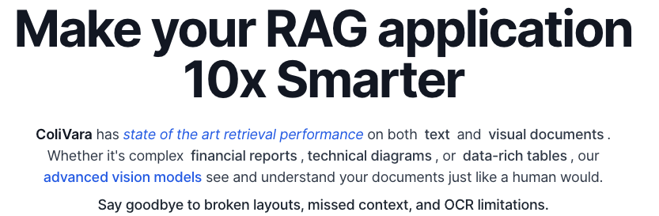

<p align="center">
  
</p>

# ColiVara

**State of the Art Retrieval - with a delightful developer experience**

## Key Features

- **State of the Art retrieval**: ColiVara outperforms existing retrieval systems on both quality and latency.
- **Wide Format Support**: Supports over 100 file formats including PDF, DOCX, PPTX, and more.
- **Filtering**: ColiVara allows for filtering on collections and documents on arbitrary metadata fields. For example, you can filter documents by author or year. Or filter collections by type. You get the best of both worlds - structured and unstructured data.
- **Convention over Configuration**: The API is designed to be easy to use with opinionated and optimized defaults.
- **Modern PgVector Features**: We use HalfVecs for faster search and reduced storage requirements.
- **REST API**: Easy to use REST API with Swagger documentation.
- **Comprehensive**: Full CRUD operations for documents, collections, and users.


## Getting Started (Local Setup)

1. Setup the Embeddings Service (ColiVarE) - This is a separate repo and is required for the API to work. The directions are available here: [ColiVarE](https://github.com/tjmlabs/ColiVarE/blob/main/readme.md)

```bash
docker run --runtime=nvidia -p 8000:8005 vualidon1403/colivare:20250528
```

2. Clone the repo

```bash
git clone https://github.com/tjmlabs/ColiVara
```

2. Create a .env.dev file in the root directory with the following variables:

```
EMBEDDINGS_URL="the serverless embeddings service url" # for local setup use http://host.docker.internal:8000/runsync
EMBEDDINGS_URL_TOKEN="the serverless embeddings service token"  # for local setup use any string will do.
AWS_S3_ACCESS_KEY_ID="an S3 or compatible storage access key"
AWS_S3_SECRET_ACCESS_KEY="an S3 or compatible storage secret key"
AWS_STORAGE_BUCKET_NAME="an S3 or compatible storage bucket name"
AWS_STORAGE_REGION_NAME="an S3 or compatible storage bucket region name"
```

3. Run the following commands:

```bash
docker compose up -d --build
docker compose exec web python manage.py migrate
docker compose exec web python manage.py createsuperuser
# get the token from the superuser creation
docker compose exec web python manage.py shell
from accounts.models import CustomUser
user = CustomUser.objects.first().token 
print(user) # save this token somewhere (use it for authorization)
```

4. Application will be running at <http://localhost:8001> and the swagger documentation at <http://localhost:8001/v1/docs>
5. To run tests - we have 100% test coverage

```bash
docker compose exec web pytest
```

6. mypy for type checking

```bash
docker compose exec web mypy .
```

## Support

For support, join our Discord community where you can:

- Get help with setup and configuration
- Report bugs and request features
- Connect with other ColiVara users
- Stay updated on new releases and announcements

Click the badge below to join:

[](https://discord.gg/DtGRxWuj8y)

## License

This project is licensed under Functional Source License, Version 1.1, Apache 2.0 Future License. See the [LICENSE.md](LICENSE.md) file for details.

For commercial licensing, please contact us at [tjmlabs.com](https://tjmlabs.com). We are happy to work with you to provide a license that meets your needs.
